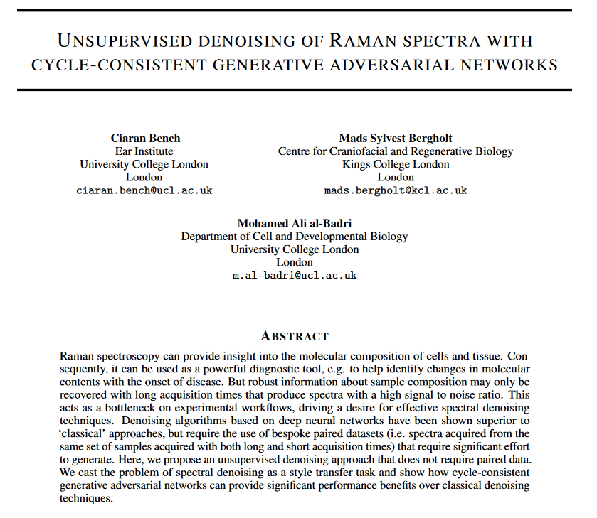
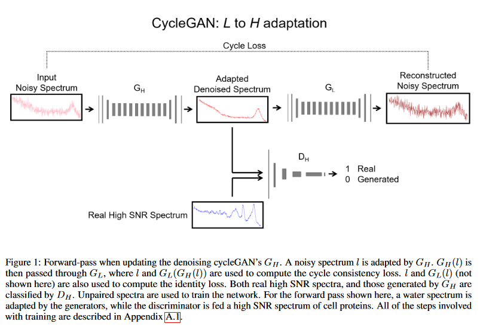

# Raman Spectral Denoising CycleGAN

This is the code repository for:

['Unsupervised denoising of Raman spectra with cycle-consistent generative adversarial networks'](https://arxiv.org/abs/2307.00513), Ciaran Bench, Mads Sylvest Bergholt, Mohamed Ali al-Badri, arXiv physics.med-ph, 307.00513 (2023)

 

Training/validation/test data can be downloaded from this [Google Drive link](https://drive.google.com/drive/folders/1d7KSXt-ZDyDc_YGKFiEZV5ckLYmrl6y8?usp=sharing).
The original spectral dataset adapted for this study can be found [here](https://github.com/conor-horgan/DeepeR). 

Training scripts were written for TensorFlow 2.12

notes:concat=add, image adapt=c.o.d. i.e. infeasible
